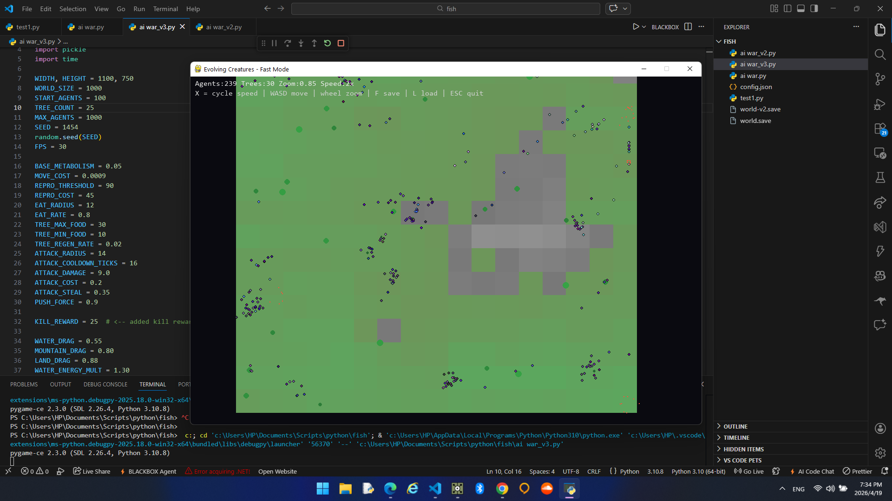
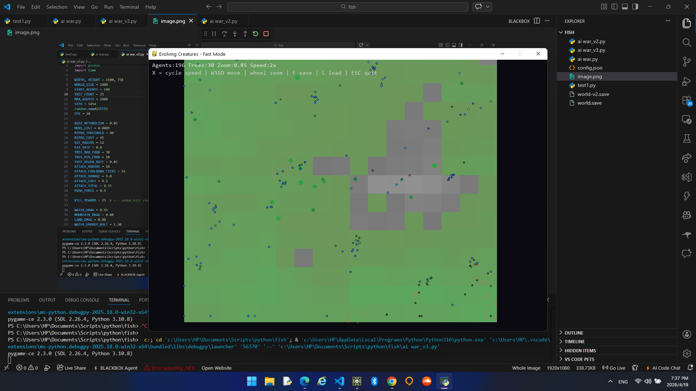
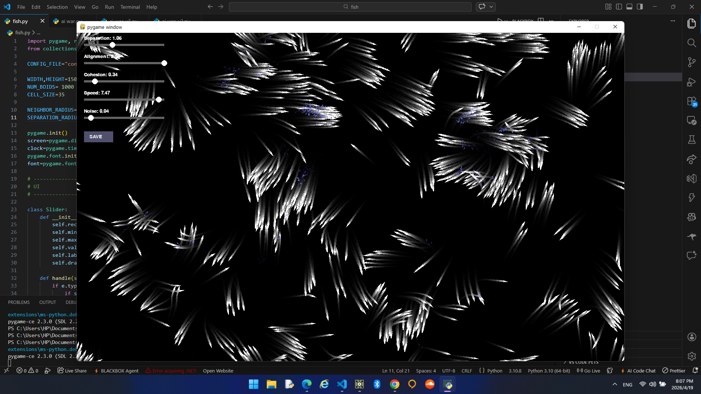

# AI Evolving Creatures + Fish Boids

Built on a **boring day in the middle of an internet blackout in war**.  

hope to see a day with freedom, freedom of speech, freedom of thought, and a world where people can express themselves openly and live without oppression.
a day that gpt dont say i cant talk about goverments,dictatorships,...
in 50th days of full internet blackout
 
for the W 

This project was made **100% with AI assistance**.

Two small real‑time simulations written in **Python + Pygame** exploring famous artificial life and graphics concepts.

---

## 1. AI Evolution Simulation

Tiny creatures move around a world, eat, fight, reproduce, and evolve.  
Each creature is controlled by a **small neural network**, and behaviors emerge naturally over time.

Concepts used:
- neural networks
- mutation & evolution
- procedural terrain
- spatial hashing
- particle effects

### Creature Placeholders

---

## 2. Fish / Boids Simulation

A schooling simulation based on the famous **Boids flocking algorithm**.

Fish move using three classic rules:
- separation
- alignment
- cohesion

Additional features include noise motion, trails, and spark effects.

### Fish Placeholder

---
